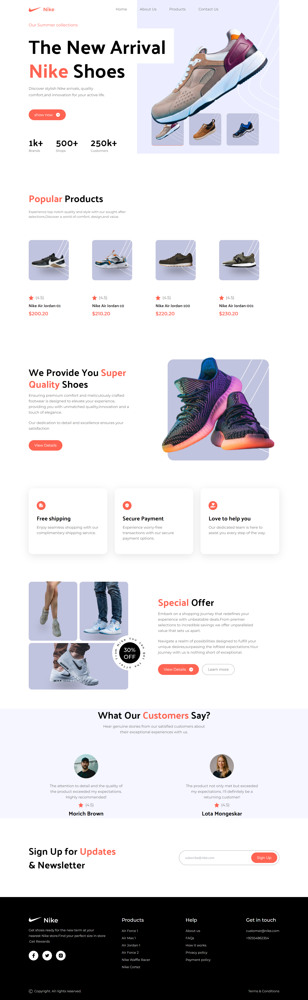

# React + Vite

## Nike Website Clone - React, Tailwind CSS, Vite

## Description

This project is a clone of the official Nike website developed using React, Tailwind CSS, and Vite. The website replicates the design and functionality of the original Nike site, showcasing various products, categories, and features. Tailwind CSS is used for efficient and responsive styling, ensuring a modern and visually appealing user interface. Vite is utilized as the build tool to provide fast and optimized development and production builds. With this project, developers can explore and learn how to implement complex UI designs and interactions using React components and Tailwind CSS utility classes in a modern build environment facilitated by Vite.

This template provides a minimal setup to get React working in Vite with HMR and some ESLint rules.

Currently, two official plugins are available:

- [@vitejs/plugin-react](https://github.com/vitejs/vite-plugin-react/blob/main/packages/plugin-react/README.md) uses [Babel](https://babeljs.io/) for Fast Refresh
- [@vitejs/plugin-react-swc](https://github.com/vitejs/vite-plugin-react-swc) uses [SWC](https://swc.rs/) for Fast Refresh
